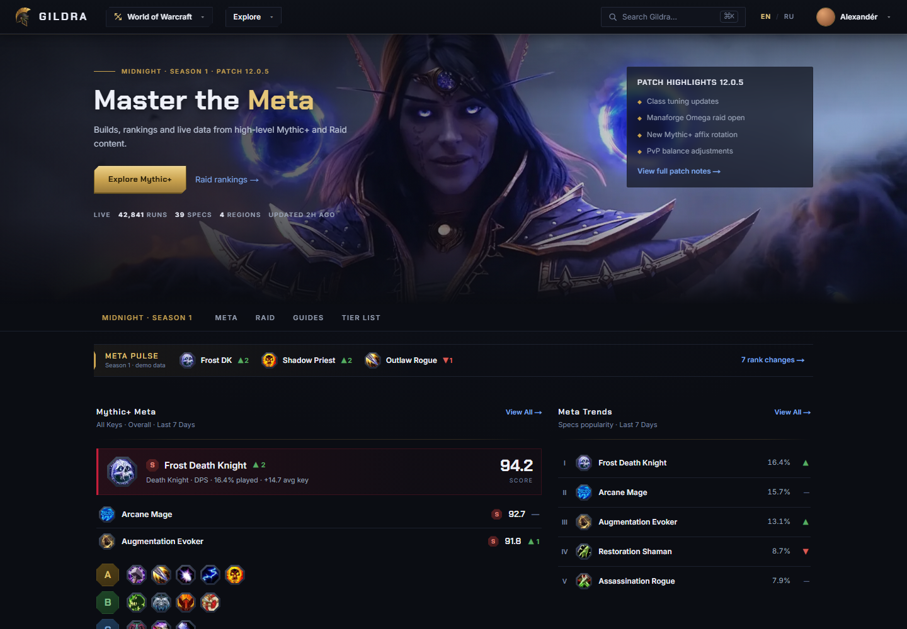
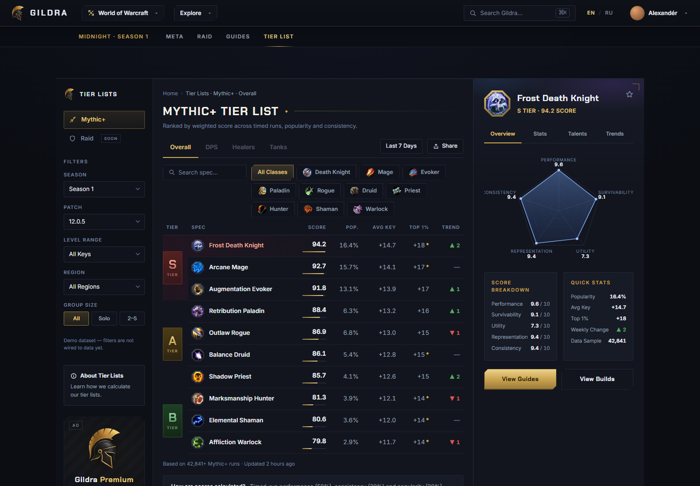
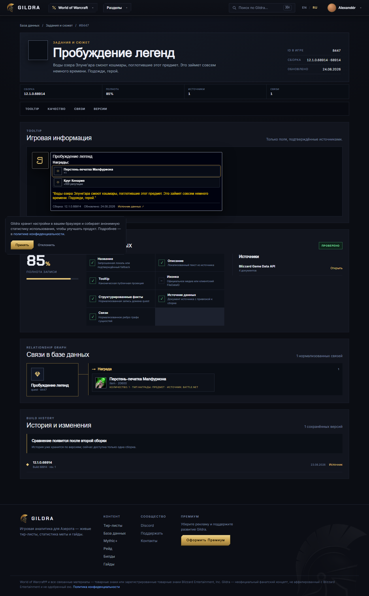
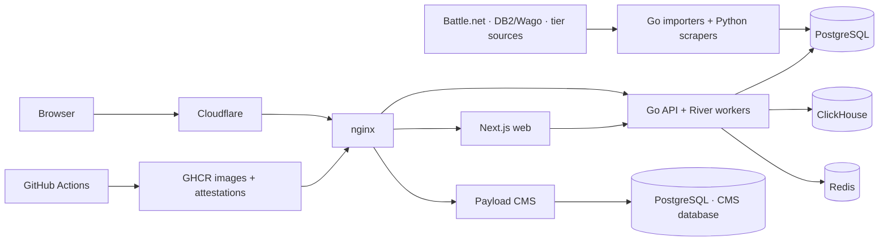

<div align="center">
  
  <h1>Gildra</h1>
  <p><strong>Gaming intelligence for World of Warcraft — rankings, verified catalog data, and source-aware tooltips.</strong></p>
  <p>English and Russian · Next.js · Go · PostgreSQL · ClickHouse · Redis · Payload CMS</p>
</div>

Gildra is a production-oriented portfolio project built as a modular monolith.
It combines a bilingual gaming interface with a versioned data catalog, source
provenance, relationship graphs, automated ingestion, analytics, and a
hardened container delivery pipeline.

The repository is intentionally broader than a UI demo: it contains the public
website, API and background workers, CMS, data importers, database migrations,
scrapers, operational configuration, and tests in one reviewable codebase.

## Product preview

| Meta overview | Interactive tier lists |
| --- | --- |
|  |  |

### Verified quest rewards and tooltip relationships



## Highlights

- Responsive Next.js 16 interface with a static Russian mirror and shared
  localization rules.
- Searchable catalog for quests, items, spells, talents, professions,
  creatures, instances, classes, and specializations.
- Canonical tooltips backed by versioned source documents instead of invented
  display data.
- Normalized relationship graph for quest rewards, talent dependencies,
  spell effects, item acquisition, and cross-entity navigation.
- Source provenance, build history, completeness scoring, publication gates,
  and last-known-good read models.
- Go API generated from OpenAPI plus GraphQL, River background jobs, health
  endpoints, Sentry hooks, and IndexNow delivery.
- PostgreSQL for catalog and application state, ClickHouse for product
  analytics, and Redis for short-lived caches.
- Payload CMS with its own PostgreSQL database and migration lifecycle.
- Reproducible scraper image with explicit provider budgets, preflight checks,
  regression bounds, and snapshot safety tests.
- Docker Compose deployment with health checks, immutable production images,
  read-only containers, and least-privilege runtime settings.
- GitHub Actions with SHA-pinned actions, scoped token permissions, SBOM and
  provenance generation, digest-based deployment, rollback manifests, and
  post-deploy smoke tests.

## Architecture



The application is deployed as one modular monolith: one repository and one
release, with isolated processes and data ownership boundaries. OpenAPI is the
shared contract between generated Go server types and the TypeScript client.
See [the architecture notes](docs/architecture.md) for storage and runtime
details.

## Repository map

| Path | Responsibility |
| --- | --- |
| `app/`, `components/`, `lib/` | Public Next.js application and API client |
| `backend/` | Go API, workers, importers, GraphQL, and database migrations |
| `cms/` | Payload CMS application and CMS migrations |
| `scraper/` | Source profiles, parsers, publication services, and tests |
| `infra/` | nginx, PostgreSQL initialization, and scheduled refresh units |
| `.github/workflows/` | Continuous integration and controlled deployment |
| `docs/` | Architecture, catalog model, imports, sources, and deployment |

## Run locally

### Prerequisites

- Node.js 22.23.2 or compatible Node.js 22 release
- npm
- Go 1.26.6 for backend development
- Docker Desktop or Docker Engine with the Compose plugin for the full stack

### Full stack with Docker

Copy the environment template and replace every `change-me-*` value before
starting the stack:

```powershell
Copy-Item .env.example .env
docker compose -f compose.yml -f compose.local.yml config
docker compose -f compose.yml -f compose.local.yml up --build
```

The local nginx gateway is available at <http://localhost:8088>. PostgreSQL,
Redis, and application services remain on the internal Compose network;
ClickHouse is exposed only on loopback by `compose.local.yml` for diagnostics.

Stop the stack without deleting its named volumes:

```powershell
docker compose -f compose.yml -f compose.local.yml down
```

### Frontend-only preview

The marketing and tier-list UI can be developed without the full stack.
Catalog routes still require the Go API.

```powershell
npm ci
npm run generate:api
npm run dev
```

### CMS

```powershell
Set-Location cms
npm ci
npm run build
npm run dev
```

## Verification

The main checks mirror the CI workflow:

```powershell
# Web
npm ci
npm run generate:api
npm run typecheck
npm run build

# CMS
Set-Location cms
npm ci
npm run build

# Go API and migrations
Set-Location ..\backend
go generate ./...
go tool goose -dir migrations/postgres validate
go tool goose -dir migrations/clickhouse validate
go vet ./...
go test -race ./...

# Requires a running Docker daemon for Testcontainers
go test -tags=integration -count=1 -timeout=10m ./integration
```

Scraper verification uses the same container that runs in production:

```powershell
Set-Location ..
docker build -t gildra-scraper-check ./scraper
docker run --rm -e SCRAPE_DO_TOKEN=TESTTOKEN gildra-scraper-check /app/config/production.json --preflight
docker run --rm --entrypoint python -v "${PWD}:/workspace:ro" -w /workspace gildra-scraper-check -m unittest discover -s scraper/tests -p 'test_*.py' -v
```

## Catalog documentation

- [Catalog API](docs/catalog-api.md)
- [Data model and relationship graph](docs/catalog-data-model.md)
- [Import and verification pipeline](docs/catalog-import.md)
- [Source policy: All The Things](docs/catalog-source-all-the-things.md)
- [OVHcloud deployment](docs/deploy-ovh.md)

## Data and trademark notice

This repository does not include production databases, credentials, private
API responses, or scraped page archives. Importers require separately supplied
credentials and reviewed source access.

World of Warcraft, Warcraft, Battle.net, Blizzard Entertainment, and related
marks and game assets are property of their respective owners. Gildra is an
independent portfolio and fan project and is not affiliated with or endorsed by
Blizzard Entertainment. See [NOTICE](NOTICE) for the asset and trademark
boundary.

## License

Original source code and documentation are available under the [MIT License](LICENSE).
Third-party names, trademarks, data, and visual assets are excluded from that
license unless their own license explicitly says otherwise.
